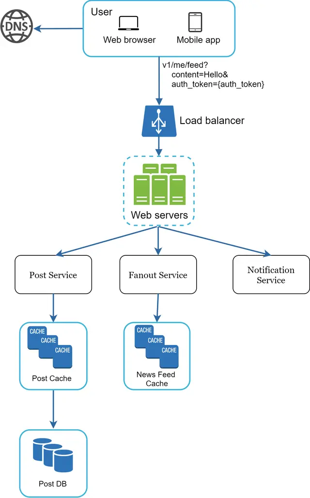
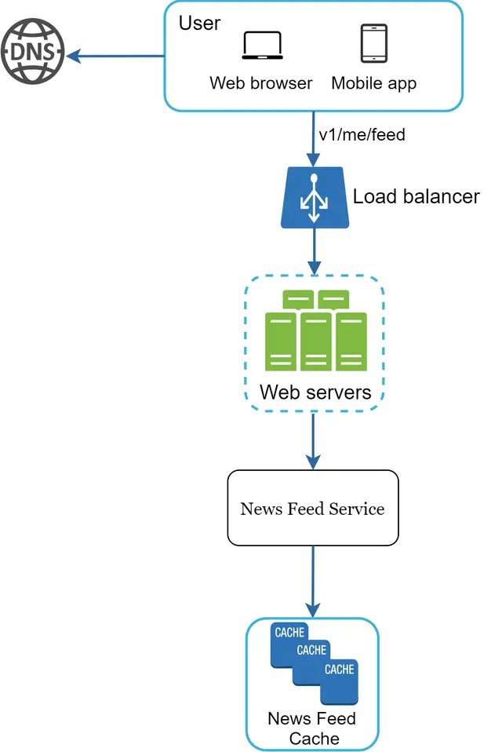
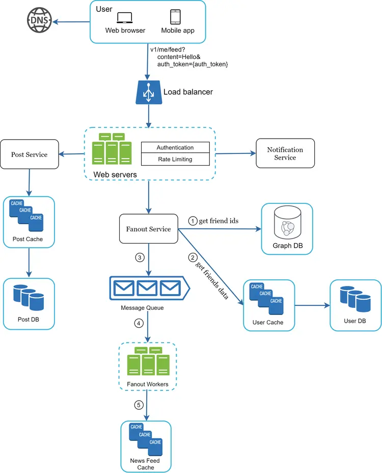
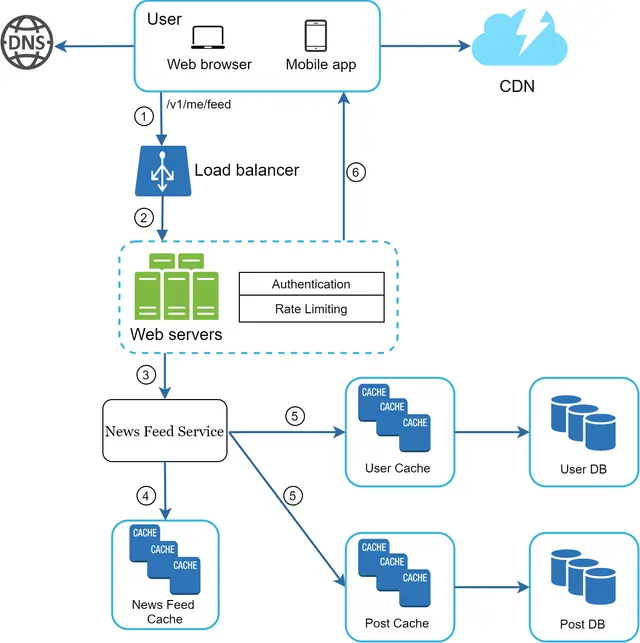

# A Framework for System Design Interviews

You have just landed a coveted on-site interview at your dream company. The hiring coordinator sends you a schedule for that day. Scanning down the list, you feel pretty good about it until your eyes land on this interview session - System Design Interview.

System design interviews are often intimidating. It could be as vague as “designing a well-known product X?”. The questions are ambiguous and seem unreasonably broad. Your weariness is understandable. After all, how could anyone design a popular product in an hour that has taken hundreds if not thousands of engineers to build?

The good news is that no one expects you to. Real-world system design is extremely complicated. For example, Google search is deceptively simple; however, the amount of technology that underpins that simplicity is truly astonishing. If no one expects you to design a real-world system in an hour, what is the benefit of a system design interview?

The system design interview simulates real-life problem solving where two co-workers collaborate on an ambiguous problem and come up with a solution that meets their goals. The problem is open-ended, and there is no perfect answer. The final design is less important compared to the work you put in the design process. This allows you to demonstrate your design skill, defend your design choices, and respond to feedback in a constructive manner.

Let us flip the table and consider what goes through the interviewer’s head as she walks into the conference room to meet you. The primary goal of the interviewer is to accurately assess your abilities. The last thing she wants is to give an inconclusive evaluation because the session has gone poorly and there are not enough signals. What is an interviewer looking for in a system design interview?

Many think that system design interview is all about a person's technical design skills. It is much more than that. An effective system design interview gives strong signals about a person's ability to collaborate, to work under pressure, and to resolve ambiguity constructively. The ability to ask good questions is also an essential skill, and many interviewers specifically look for this skill.

A good interviewer also looks for red flags. Over-engineering is a real disease of many engineers as they delight in design purity and ignore tradeoffs. They are often unaware of the compounding costs of over-engineered systems, and many companies pay a high price for that ignorance. You certainly do not want to demonstrate this tendency in a system design interview. Other red flags include narrow mindedness, stubbornness, etc.

In this chapter, we will go over some useful tips and introduce a simple and effective framework to solve system design interview problems.

# A 4-step process for effective system design interview

Every system design interview is different. A great system design interview is open-ended and there is no one-size-fits-all solution. However, there are steps and common ground to cover in every system design interview.

# Step 1 - understand the problem and establish design scope

"Why did the tiger roar?"
A hand shot up in the back of the class.
"Yes, Jimmy?", the teacher responded.
"Because he was HUNGRY".
"Very good Jimmy."

Throughout his childhood, Jimmy has always been the first to answer questions in the class. Whenever the teacher asks a question, there is always a kid in the classroom who loves to take a crack at the question, no matter if he knows the answer or not. That is Jimmy.

Jimmy is an ace student. He takes pride in knowing all the answers fast. In exams, he is usually the first person to finish the questions. He is a teacher's top choice for any academic competition.

DON'T be like Jimmy.

In a system design interview, giving out an answer quickly without thinking gives you no bonus points. Answering without a thorough understanding of the requirements is a huge red flag as the interview is not a trivia contest. There is no right answer.

So, do not jump right in to give a solution. Slow down. Think deeply and ask questions to clarify requirements and assumptions. This is extremely important.

As an engineer, we like to solve hard problems and jump into the final design; however, this approach is likely to lead you to design the wrong system. One of the most important skills as an engineer is to ask the right questions, make the proper assumptions, and gather all the information needed to build a system. So, do not be afraid to ask questions.

When you ask a question, the interviewer either answers your question directly or asks you to make your assumptions. If the latter happens, write down your assumptions on the whiteboard or paper. You might need them later.

What kind of questions to ask? Ask questions to understand the exact requirements. Here is a list of questions to help you get started:

 * What specific features are we going to build?
 * How many users does the product have?
 * How fast does the company anticipate to scale up? What are the anticipated scales in 3 months, 6 months, and a year?
 * What is the company’s technology stack? What existing services you might leverage to simplify the design?
 
# Example

If you are asked to design a news feed system, you want to ask questions that help you clarify the requirements. The conversation between you and the interviewer might look like this:

<b>Candidate:</b> Is this a mobile app? Or a web app? Or both?
<b>Interviewer:</b> Both.

<b>Candidate:</b> What are the most important features for the product?
<b>Interviewer:</b> Ability to make a post and see friends’ news feed.

<b>Candidate:</b> Is the news feed sorted in reverse chronological order or a particular order? The particular order means each post is given a different weight. For instance, posts from your close friends are more important than posts from a group.
<b>Interviewer:</b> To keep things simple, let us assume the feed is sorted by reverse chronological order.

<b>Candidate:</b> How many friends can a user have?
<b>Interviewer:</b> 5000

<b>Candidate:</b> What is the traffic volume?
<b>Interviewer:</b> 10 million daily active users (DAU)

<b>Candidate:</b> Can feed contain images, videos, or just text?
<b>Interviewer:</b> It can contain media files, including both images and videos.

Above are some sample questions that you can ask your interviewer. It is important to understand the requirements and clarify ambiguities

# Step 2 - Propose high-level design and get buy-in

In this step, we aim to develop a high-level design and reach an agreement with the interviewer on the design. It is a great idea to collaborate with the interviewer during the process.

 * Come up with an initial blueprint for the design. Ask for feedback. Treat your interviewer as a teammate and work together. Many good interviewers love to talk and get involved.
 * Draw box diagrams with key components on the whiteboard or paper. This might include clients (mobile/web), APIs, web servers, data stores, cache, CDN, message queue, etc.
 * Do back-of-the-envelope calculations to evaluate if your blueprint fits the scale constraints. Think out loud. Communicate with your interviewer if back-of-the-envelope is necessary before diving into it.

If possible, go through a few concrete use cases. This will help you frame the high-level design. It is also likely that the use cases would help you discover edge cases you have not yet considered.

Should we include API endpoints and database schema here? This depends on the problem. For large design problems like “Design Google search engine”, this is a bit of too low level. For a problem like designing the backend for a multi-player poker game, this is a fair game. Communicate with your interviewer.

# Example

Let us use “Design a news feed system” to demonstrate how to approach the high-level design. Here you are not required to understand how the system actually works. All the details will be explained in the "Design A News Feed System" chapter.

At the high level, the design is divided into two flows: feed publishing and news feed building.

 * Feed publishing: when a user publishes a post, corresponding data is written into cache/database, and the post will be populated into friends’ news feed.
 * Newsfeed building: the news feed is built by aggregating friends’ posts in a reverse chronological order.

Figure 1 and Figure 2 present high-level designs for feed publishing and news feed building flows, respectively.

	Figure 1

	Figure 2

# Step 3 - Design deep dive
At this step, you and your interviewer should have already achieved the following objectives:

 * Agreed on the overall goals and feature scope
 * Sketched out a high-level blueprint for the overall design
 * Obtained feedback from your interviewer on the high-level design
 * Had some initial ideas about areas to focus on in deep dive based on her feedback

You shall work with the interviewer to identify and prioritize components in the architecture. It is worth stressing that every interview is different. Sometimes, the interviewer may give off hints that she likes focusing on high-level design. Sometimes, for a senior candidate interview, the discussion could be on the system performance characteristics, likely focusing on the bottlenecks and resource estimations. In most cases, the interviewer may want you to dig into details of some system components. For URL shortener, it is interesting to dive into the hash function design that converts a long URL to a short one. For a chat system, how to reduce latency and how to support online/offline status are two interesting topics.

Time management is essential as it is easy to get carried away with minute details that do not demonstrate your abilities. You must be armed with signals to show your interviewer. Try not to get into unnecessary details. For example, talking about the EdgeRank algorithm of Facebook feed ranking in detail is not ideal during a system design interview as this takes much precious time and does not prove your ability in designing a scalable system.

# Example
At this point, we have discussed the high-level design for a news feed system, and the interviewer is happy with your proposal. Next, we will investigate two of the most important use cases:

1. Feed publishing
2. News feed retrieval

Figure 3 and Figure 4 show the detailed design for the two use cases, which will be explained in detail in the "Design A News Feed System" chapter.
Example design deep dive for feed publishing:

	Figure 3

	Figure 4

## Step 4 - Wrap up

In this final step, the interviewer might ask you a few follow-up questions or give you the freedom to discuss other additional points. Here are a few directions to follow:

 * The interviewer might want you to identify the system bottlenecks and discuss potential improvements. Never say your design is perfect and nothing can be improved. There is always something to improve upon. This is a great opportunity to show your critical thinking and leave a good final impression.
 * It could be useful to give the interviewer a recap of your design. This is particularly important if you suggested a few solutions. Refreshing your interviewer’s memory can be helpful after a long session.
 * Error cases (server failure, network loss, etc.) are interesting to talk about.
 * Operation issues are worth mentioning. How do you monitor metrics and error logs? How to roll out the system?
 * How to handle the next scale curve is also an interesting topic. For example, if your current design supports 1 million users, what changes do you need to make to support 10 million users?
 * Propose other refinements you need if you had more time.

To wrap up, we summarize a list of the Dos and Don’ts.

Dos

 * Always ask for clarification. Do not assume your assumption is correct.
 * Understand the requirements of the problem.
 * There is neither the right answer nor the best answer. A solution designed to solve the problems of a young startup is different from that of an established company with millions of users. Make sure you understand the requirements.
 * Let the interviewer know what you are thinking. Communicate with your interview.
 * Suggest multiple approaches if possible.
 * Once you agree with your interviewer on the blueprint, go into details on each component. Design the most critical components first.
 * Bounce ideas off the interviewer. A good interviewer works with you as a teammate.
 * Never give up.

Don’ts

 * Don't be unprepared for typical interview questions.
 * Don’t jump into a solution without clarifying the requirements and assumptions.
 * Don’t go into too much detail on a single component in the beginning. Give the high-level design first then drills down.
 * If you get stuck, don't hesitate to ask for hints.
 * Again, communicate. Don't think in silence.
 * Don’t think your interview is done once you give the design. You are not done until your interviewer says you are done. Ask for feedback early and often.

# Time allocation on each step

System design interview questions are usually very broad, and 45 minutes or an hour is not enough to cover the entire design. Time management is essential. How much time should you spend on each step? The following is a very rough guide on distributing your time in a 45-minute interview session. Please remember this is a rough estimate, and the actual time distribution depends on the scope of the problem and the requirements from the interviewer.

Step 1 Understand the problem and establish design scope: 3 - 10 minutes

Step 2 Propose high-level design and get buy-in: 10 - 15 minutes

Step 3 Design deep dive: 10 - 25 minutes

Step 4 Wrap: 3 - 5 minutes
