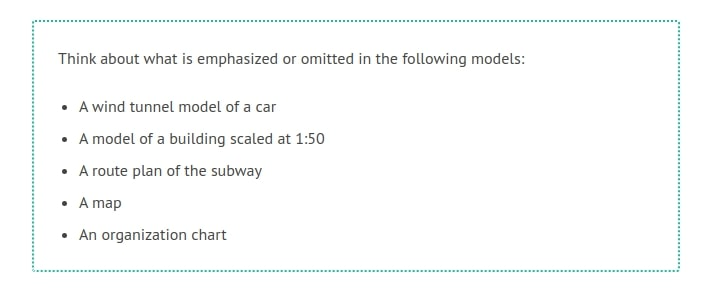
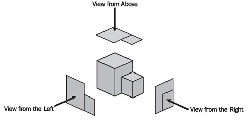
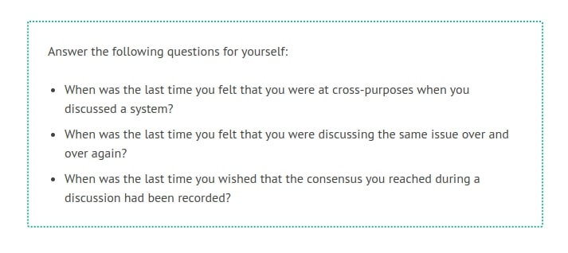
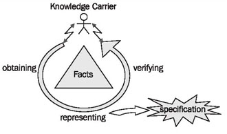
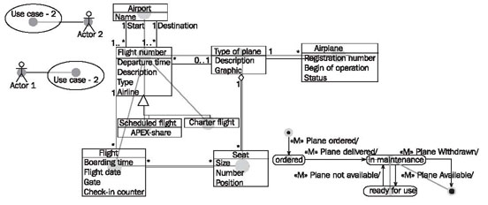
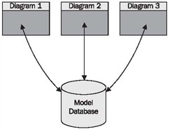

# What is a Model?

Models are often built in the context of business and IT systems in order to better understand existing or future systems. However, a model never fully corresponds to reality. Modeling always means emphasizing and omitting: emphasizing essential details and omitting irrelevant ones. But what is essential and what is irrelevant? There is no universal answer to this question. Rather, the answer depends on what the goals of the model are and who is viewing or reading it.

	
The more information a model is supposed to give, the more complex and difficult it becomes. A map of Europe, for example, that simultaneously contains political, geological, demographic, and transportation-related information is hardly legible. The solution to this problem is to convey the different types of information on individual maps. Different views are formed of the objects under consideration. These views are interconnected in many ways. Generally, if one view is changed, all other views have to be adjusted as well. If, for instance, in the Netherlands new land is reclaimed from the North Sea, all views—meaning all maps—have to be updated.

	
	Figure 2.3 Different views of an object
	
The same is true for the model of a building. If a new wing is added to an existing building various views are affected, including the floor plan, the different exterior views, and the 3D-model made from wood. Figure 2.3 illustrates this in a schematic manner. In The Models of our Case Study, we specifically address the relationships between the models we use in this book. The different views within each model are described in more detail in Modeling Business Systems, Modeling IT Systems and Modeling for System Integration.

# Why do we Need Models?

As a general rule, a model of a system has to perform the following tasks:

Communication between all involved parties: In order to build the right system, it is essential that all involved parties think along the same lines. It is particularly important that everyone understands the terminology used, that customers agree upon the same requirements, that developers understand these requirements, and that the decisions made can still be understood months later.

Visualization of all facts for customers, experts, and users: All accumulated facts relevant to the system need to be presented in such a way that everyone concerned can understand them. However, according to our real-life experience, we often hit a wall of resistance when we want to communicate with diagrams instead of text. It is necessary to overcome this resistance. Behind it is often a fear of the unknown; and the diagrams might look a bit complicated at first. Therefore, this book contains directions on how to read each diagram.

Verification of facts in terms of completeness, consistency, and correctness: A (more or less) formal model makes it possible to verify the facts obtained for completeness, consistency, and correctness. In particular, the clear depiction of interrelationships makes it possible to ask specific questions, and to answer them. We will list these questions with each diagram.

	
# Purpose and Target Group of a Model

In real life we often observe that the results of cumbersome, tedious, and expensive modeling simply disappear in a stack of paper on someone’s desk. We might ask why this is so. Two factors greatly influence the result of modeling: for whom do we create the model and for what purpose is it supposed to be used. If we don’t discuss and define these aspects sufficiently, we run the risk of creating models that don’t contain what is important to the user. In other words, if details are not emphasized and omitted appropriately, the model is rendered worthless.

To define the purpose and target group the following questions should be answered:

How much business expertise can we expect? Can we assume basic knowledge of the subject, or do we have to explain the fundamentals of the model’s events and processes?

What amount of detail does the target group need? What level of complexity does the model permit? If processes and systems are subject to constant changes, a highly detailed model might be unrealistic. This is because, most of the time, it is not possible to maintain those models in a satisfactory manner. A less detailed model requires less effort to develop and update, but it is also less precise.

How much time does the target group have to read and interpret the model? Prevent your model from disappearing in a stack of paper on someone’s desk by choosing the appropriate level of detail and complexity; otherwise, nobody might have enough time to read it.

What language can be used in the model? Does the target group understand technical business terms? Do they understand IT terminology? Let’s clarify with an easy example: If a bottle filled with water is labeled ‘water', virtually anyone who can read will understand the bottle’s content. However, if the bottle is labeled 'H2O'—even though this is correct—we reach a much smaller group of people, for example, the workers of a chemistry lab. Yet, the additional benefit is that it shows the composition of the content: hydrogen and oxygen. In either case, you will have to decide what 'label’ is most appropriate for your target group.

What level of abstraction should you choose? The less abstract a model, the more comprehensible, and clear it is for the user. This is because a less abstract model is closer to the user’s actual use and language. On the other hand, models with a high level of abstraction are more reusable and they are more easily converted into IT systems. We can also prove more accurately that they are correct. IT specialists probably manage highly abstract models best. Users, on the other hand, might pull their hair out if asked to deal with a model like that.

# Practical Tips

Compromises have to be made between the level of abstraction, clarity, and the amount of detail used for a model. It is possible to develop several model components, differing in degree of formality and detail, in order to satisfy different target groups. In this way communication between model builders, customers, users, and developers can be facilitated much more easily. It is important not to ‘overdo’ it, but to adjust the model to its target groups and their uses.

Analysis or design patterns are example models that describe common design and modeling methods.

# Process of Analysis

Figure 2.4 shows the process of analysis, which consists of obtaining, representing, and verifying facts:

	
	
	
	Figure 2.4 Process of Analysis
	
This is the job of the analyst. The process of analysis produces a specification that comes from the model and other representations. The analyst works with knowledge carriers, such as customers, users, and domain experts:

	* Facts are obtained by collaboration between analysts and domain experts in which knowledge carriers contribute domain knowledge and analysts contribute methodological knowledge.

	* Facts are represented in diagrams and documents, which are usually prepared by the analyst.

	* Facts are verified only by knowledge carriers, since they alone can decide if the presented facts are correct. Verification is absolutely essential. Without it we might have pretty diagrams, but the probability is high that the facts represented are faulty. In simple terms: development of a model without verification is absolutely worthless!
	
# Practical Tips

It is impossible to develop and verify a usable model without mastering the technical foundations of a topic. Where do we find these knowledge carriers who know something about the systems that we want to model? We have had good experiences with the following groups of people:

	* People who are involved in performing, operating, and controlling business processes
	* Users of similar or related IT systems
	* Customers, who are often critical and creative knowledge carriers
	* Business Partners
	* Domain Experts
	* Management
	* External Observers

Several helpful techniques have proven to be useful for the analysis and understanding of business processes:

	* Observing employees at work
	* Participating in the investigated business processes
	* Taking the role of an outsider (e.g. of a customer)
	* Carrying out surveys
	* Conducting interviews
	* Brainstorming with everyone involved
	* Discussing with domain experts
	* Reviewing existing forms, documentation, specifications, handbooks, and work tools
	* Describing the organizational structure and workflow management (organization charts, etc.)
	
# Diagrams as Views

Each particular UML diagram corresponds to one view of a model of a system. Depending on the type of diagram used, different aspects are either emphasized or omitted. All the different views combined result in a good model of a system. Most of the UML diagrams are graphs (as shown in Figure 2.5), implying that they consist of elements that are connected through lines:

	
	Figure 2.5 Diagram as graphs
	
To read diagrams, you have to know what types of elements and lines are allowed and what they mean. We’ll explain this for the diagrams we use in the following chapters.

Even computer-aided software engineering (CASE) tools treat UML diagrams as views. They use a database in which the information about the model is stored. Each diagram shows—as a view—a part of that information. In this way, the CASE tool helps to preserve the consistency of each view. If, for example, the name of a class is changed in a class diagram, the statechart diagram of that class is automatically updated:

	
	Figure 2.6 CASE tool as database

The model database is what fundamentally differentiates a CASE tool from a graphical program (Figure 2.6). Any UML diagram can be generated easily with paper and pencil or a graphical program. In this case, however, the various diagrams are nothing more than drawings. Only the use of a CASE tool with a database, according to UML specifications, permits consistent collection, management, and modification of model information.

UML provides its own database model: the UML meta-model, a component of the UML specifications (“OMG: Unified Modeling Language: Infrastructure, Version 2.0, Final Adopted Specification, September 2003, and OMG: Unified Modeling Language: Superstructure, Version 2.0, Revised Final Adopted Specification, October 2004”: http://www.omg.org). All elements found in UML diagrams, as well as the descriptions of these elements, are contained in the UML meta-model. It states, for example, that a class can have attributes and methods. This “data model” of UML as a language, is the foundation of the model databases of all UML CASE tools. Unfortunately, many CASE tools are hungry for resources, expensive, poorly developed, cumbersome, and require extensive training. Despite this, except for very small projects, their use is worthwhile.

